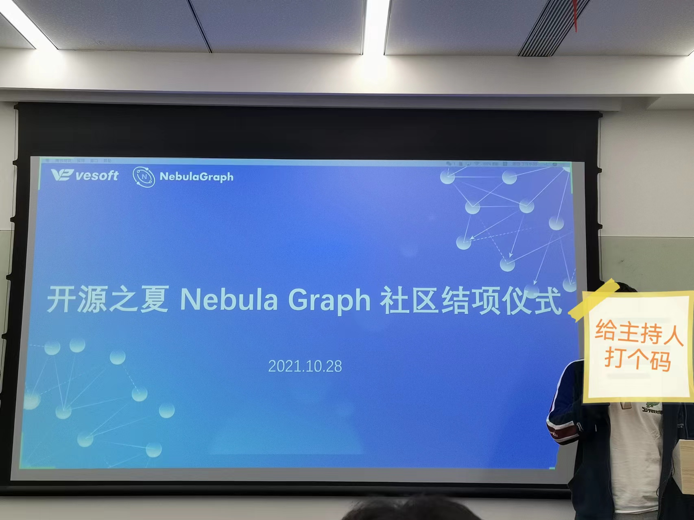
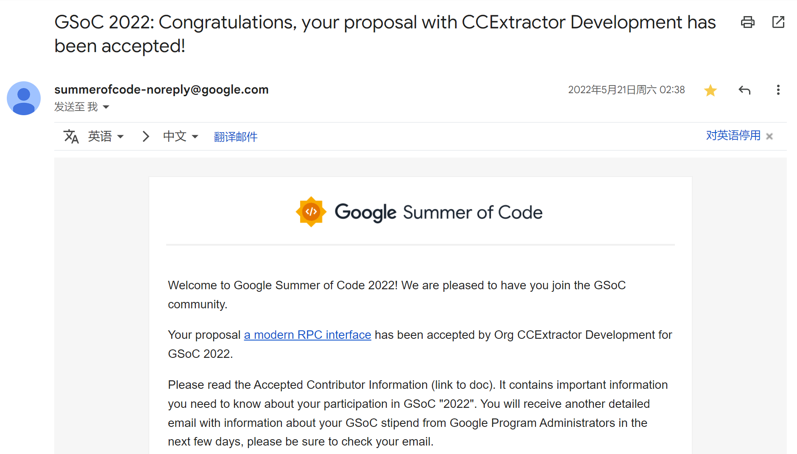

# 前言

在参与到 GSoC-like 这类活动之前，我对开源的看法简单直接且现实。当时的我只是开源的索取者，开源对我来说就是免费获取（高质量、安全）应用程序和源代码的一种方式。但是当我参与到开源后，在索取者这个身份之外我还是一个贡献者，我参与了项目的开发，社区的活动以及和其他人的交流，这不仅开阔了我的技术视野也开阔了我的认知视野，原来世界上还有这些这么酷的事情正在发生着。

理所当然地，我把我参与的 OSPP 和 GSoC 的项目写到了简历里，在找实习和秋招的时候都收到了一些大厂的 offer。这些项目经历是不是帮助我获得了面试官的青睐这一点无法考究，不过我觉得也不重要了。这些经历让我对于开源有了新的看法，我相信它带给我的某些东西能在一定程度上影响我的职业生涯。我赞同 wjsvec 所言：
> 参加开源之夏对很多同学只是打开了一扇开源的大门，而这扇大门背后，是绚丽多彩的宝藏。

# OSPP 2021

## 缘起

初次参与开源之夏是在我研一的时候，当时是我实验室的同学（我称他为 k 老师）告诉我的。最初的想法是这里的项目我都看不懂，肯定很难申请上吧？在 k 老师的鼓励和我的一番思想斗争下我转变了想法——那就试试呗，申请一下又不亏，万一让我成功了，能拿钱还能放上简历，何乐而不为呢？

## 过程

我申请的是 Nebula Graph 社区的一个 Java 项目：为图数据库 Nebula Graph 实现 JDBC 协议。当时确定选这个项目是因为我在实验室也写一些 Java，并且这个项目的描述里面的一些名词相比其他项目来说我更加能“看懂”。当时我的申请策略是锁定一个项目之后就 all in 进去，后来我在申请 GSoC 2022 的项目时也是如此。

### 与社区获得联系

我首先做的是去了解 Nebula Graph 这个图数据库，有些磕磕绊绊地在我的 Windows 机器上安装 Nebula Graph，我发现官方的论坛里好像没有关于 Windows 下的安装教程贴，于是我就写了[一篇文章](https://discuss.nebula-graph.com.cn/t/topic/4382)发表在了论坛，随后社区运营清蒸找到了我，还送了我社区的纪念品作为我在论坛发表文章的鼓励。我们交流了关于开源之夏的一些问题，跟我介绍了我的项目导师等等。

和社区套磁是申请过程中很重要的一步，以上是我和社区取得联系的经历。靠 PR 代码和导师搭上线当然是一种直接有效的方式，但不一定适用于所有社区所有项目，比如说有些项目的描述不是很清晰或者自己理解不是很到位，没有和导师充分地沟通就写代码是很困难的。所以我个人觉得这个过程不一定是要非得靠代码，也不一定是非得直接和项目导师搭上线，如果社区有像清蒸这么靠谱且有趣的运营，首先和她们取得联系也是不错的选择哈哈哈😄

之后我便尝试就项目本身和导师进行沟通。我在 Nebula Studio 中发现了 Nebula Graph 的 Server 端有暴露 HTTP 接口，于是我便想借助 OkHttp 框架在 Java 中实现与本地 Nebula Graph 的通信，在跑通了基本的 CRUD 流程后我便和导师说了我的想法，后来导师告诉我可以用基于现有的 nebula-java 去封装出 JDBC 的接口。是的，我的想法没有得到认可，但是我一点都不觉得遗憾或者难过，反而有些庆幸我跟导师沟通了，要是没沟通好自己就开始闷头做的话那就白费了更多功夫了。我在今年的 OSPP 2023 申请的过程中同样没有准确地把握技术路线，还好在 Discord 中和社区沟通过后在 proposal 中修正了过来。

充分的沟通很重要，它可以确保你始终把功夫花在正确的地方；同时这也是和导师互相了解的一个过程，如果发现和导师沟通无法取得一直或者导师本身对于项目的指导不太上心（是的，可能有些人作为项目导师纯粹是因为公司的安排，本身意愿就不高；但我相信大部分导师都是很认真负责的），那么也可以及时止损，寻找其他项目或者其他社区的机会。或许开源之夏这个活动以及某些社区某些人并不是百分百美好，但只要用心挖掘总还是有机会的。

### coding

我的 nebula-jdbc 项目在申请时被标注为一个中等难度的项目，本身并不难，特别在是导师说可以基于现有的 nebula-java 封装之后。接下来我找到了 JDBC Specification，仔细读了一遍尽量不让自己的理解出错；而后就是在 JDBC 的各个接口中调用 nebula-java 的 API 去实现对应的功能了，这一部分有[一篇当时发表在 OSPP 公众号的文章](https://mp.weixin.qq.com/s/u1iTb_K0EoMboxTrvb3P3Q)。

时隔两年之后回望当时做项目写代码的过程，很多细节都已经模糊了。但我还清晰地记得那个暑假里和 k 老师（他也参加了 OSPP 的活动）在实验室互相讨论，彼此鼓励（~~商业互吹~~），一起吃饭游泳的日子。

## 后来

在导师的指导下我的项目顺利结项了，不仅收获了来自清蒸的一系列的社区周边，后面导师还送了我一个键盘作为礼物哈哈哈哈。此后在清蒸的邀请（~~坑蒙拐骗~~）下在社区出了[一期访问](https://discuss.nebula-graph.com.cn/t/topic/5656)，还在 Nebula Graph 母公司的邀请下去到杭州参加社区举办的开源之夏线下总结会，认识了其他参加 Nebula 社区项目的同学，也是借此机会和 Wey 他们一起吃了个饭😄

# GSoC 2022

## 缘起

我是在参与 OSPP 之后才知道的 GSoC——比起 OSPP 历史更悠久面向范围更广泛
。在我得知要申请上面的项目是要和全球范围内的开发者竞争时我内心又是打起了退堂鼓的。和之前参加 OSPP 不一样的是当时的我已经不是一个纯小白了，怎么说也是有过 OSPP 经验的，这给了我很大的信心，所以还是试试呗，申请一下又不亏哈哈哈。

GSoC 的项目真是又多又杂啊，甚至还有保护鲸鱼的组织和项目，这就是 diversity 吗哈哈哈。一开始并没有想好尝试哪个项目，想着从自己的技术栈出发找一些项目看看，我对 Linux C++ 比较有兴趣所以想找一些这方面的项目，一番浏览下来发现了 [Develop a MPD server inside VLC](https://wiki.videolan.org/SoC_2022/)、[Casbin for C/C++](https://github.com/casbin/SummerOfCode2022#casbin-for-cc)、HAIKU 以及 [Introduce WebSockets into rTorrent](https://ccextractor.org/public/gsoc/rtorrent-modern-rpc/)，其中 VLC 和 HAIKU 初看上去不太契合我，Casbin 的有尝试过跑一下项目不过也没啥思路，最后发现了 rTorrent 的这个项目，主要是为 rTorrent 引入 Websockets 协议，涉及到网络编程和 Modern C++，二者我都有一点基础并且也都挺感兴趣的所以就锁定这个项目了。并没有想过同时尝试多个项目，因为不想花很多时间精力去多线程，认定好一个然后 all in 就好了，尽人事听天命，这是我在参加这类活动的一贯做法。

## 套磁

项目了解的差不多了就在 slack 上联系导师，首先介绍了自己的基本情况、个人技术栈以及去年开源之夏的经历之类的背景等。第二天 mentor 就回复我了，说我的 profile looks great，和我讲了一下项目的目标，以及接下来会发布 qualification tasks to identify the best candidate。接下来我认真地完成了 mentor 发布的 qualification tasks，在这个过程中也让我对完成项目有了更大的把握；于是便着手写 proposal，参考了这个 [repo](https://github.com/saketkc/fos-proposals)，后来我在项目顺利结项之后也把我自己的 proposal 通过 [PR](https://github.com/saketkc/fos-proposals/pull/25) 回馈给了这个 repo。

我对自己的前期工作以及和 mentor 的交流过程感觉还是挺不错的，所以认为自己中选的概率还是比较大的。GSoC 从截止提交 proposal 到公布中选中间隔了一个月，还是让人等得够久的，中间我给 rTorrent 提交了两个 commit，初步引入了 websocket，给 mentor 看后他说 looks good at the first glance。至此我就觉得中选应该没问题了，意料之内地收到了中选邮件哈哈哈哈。

## 过程

印象深刻的是关于 websocket 库的选择，我们希望有一个支持在 unix domain socket 上运行 websocket 服务的 lib。一开始我的计划是使用 [uWebsockets](https://github.com/uNetworking/uWebSockets)，这是一个 C++ 实现的 websocket 库，底层依赖 [uSockets](https://github.com/uNetworking/uSockets) 进行网络通信，性能优越，API 很简洁优雅，github 上有 15 k+ stars，但遗憾的是当时的它并不支持 unix domain socket；另一个选择是 libwebsocket，有 unix domain socket 支持，不过是 C 写的，接口比较 old-style 我很难看懂。

在 mentor 的建议下我尝试给 uWebsockets 加上 unix domain socket 支持。一开始没有任何头绪，在 uWebsockets 和 uSockets 中翻遍了所有跟 unix domain socket 有关的 issue，一番了解下来知道了可以从 uSockets 的 bsd.c 这个文件中的创建 socket 部分入手，接着还在 uWebsockets 中提了一个 [discussion](https://github.com/uNetworking/uWebSockets/discussions/1438)，@ 了好多人都没人理我。。。实际动手操作后竟然真的让我做出来了，比想象中的简单许多，这也得益于这个库本身的设计和编码都很优秀。在 uSockets 中提了 [PR](https://github.com/uNetworking/uSockets/pull/178) 回馈给社区，经历了大半年后 PR 终于 merged 了，当时我是很激动的，因为这是一个我从实际需求出发所做的并且还被作者认可的一项工作，给一个一万多 stars 的 repo 提了一个实际的 PR 是一件很让我自豪的事情。（在 OSPP 2021 中除了项目外我几乎没什么贡献了，但在 GSoC 2022 中除了项目本身外我还回馈了一篇 proposal 和给其他社区的 PR，我觉得这是我的进步）

关于我在 GSoC 2022 中的详细经历我写在了我的[博客](https://young-flash.github.io/2022/05/21/GSoC%202022%20Series%201/)中，就不在此赘述了。

# 最后

最后我想以我在 GSoC 2022 的 [proposal](https://github.com/saketkc/fos-proposals/blob/master/GSoC-2022/Accepted/CCExtractor-DongyangZheng-Introduce-WebSocket-into-rTorrent/DongyangZheng-Introduce%20WebSocket%20into%20rTorrent.md) 中的一句话作为结尾：
> Although GSoC 2022 may be over, my enthusiasm for open source isn't.

# 参考

- [nebula-jdbc](https://github.com/nebula-contrib/nebula-jdbc)
- [在 Discord 中和社区沟通项目](https://discord.com/channels/1081052318650339399/1109814626046197770)
- [请还国内开源活动一片净土](https://blog.aflybird.cn/2023/06/please-stop-fucking-open-source-activities-in-china/)
- [我的 GSoC 2022 系列 Blog](https://young-flash.github.io/2022/05/21/GSoC%202022%20Series%201/)